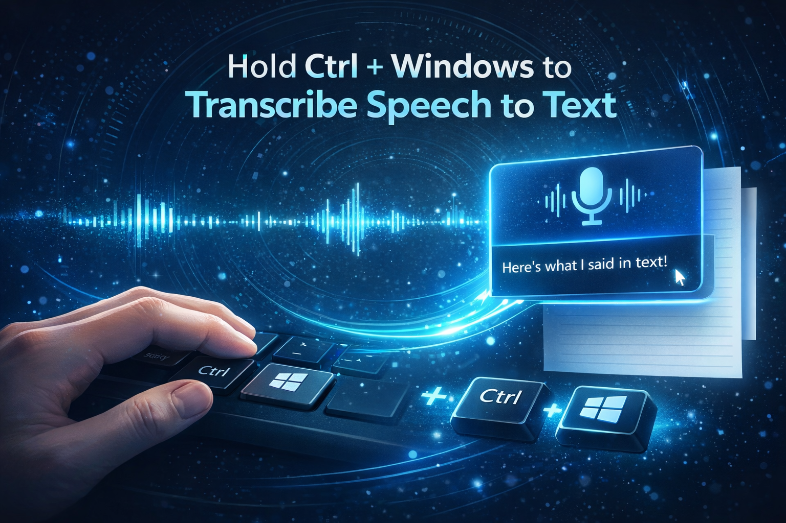

# PushToTalkSTT

A completely **free** and **offline** Windows speech-to-text app packaged as a single `.exe` file. Powered by the [Cohere Transcribe (03-2026)](https://huggingface.co/CohereLabs/cohere-transcribe-03-2026) model.

## 🚀 Download & Installation

Due to GitHub's 2GB file size limit, the application has been split into multiple compressed parts. Please follow these steps to extract and run the app:

1. Go to the **[Latest Release page](https://github.com/alperugurca/PushToTalkSTT/releases/latest)**.
2. Download **all the parts** (e.g., `PushToTalkSTT.7z.001`, `.002`, `.003`, etc.) and place them into the **same folder** on your computer.
3. Once all parts are fully downloaded, right-click **only** the file ending in **`.001`**.
4. Using **[7-Zip](https://www.7-zip.org/)** (or WinRAR), select **"Extract Here"**.
5. The extraction tool will automatically detect the other parts, combine them, and extract the final `PushToTalkSTT.exe` file.

## How to Use

1. Double-click the extracted `PushToTalkSTT.exe` to open the app.
2. Hold **Ctrl + Windows key** to record.
3. Release the keys to stop.
4. The app transcribes your speech, copies the text, and pastes it where your cursor is active.
